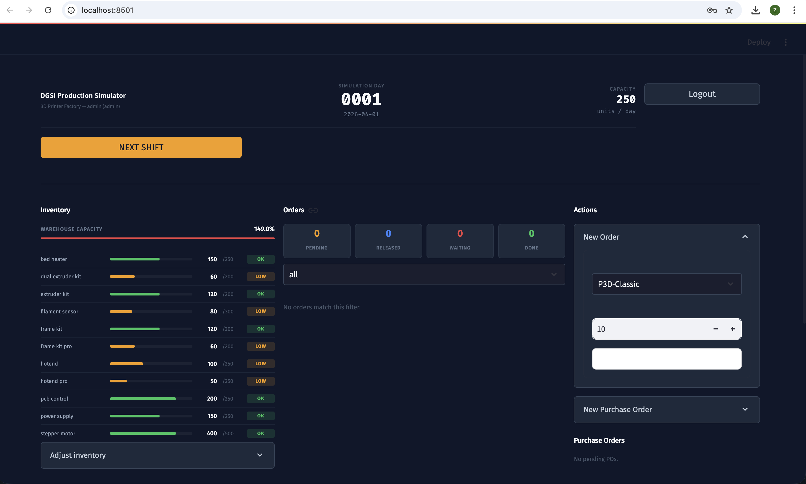
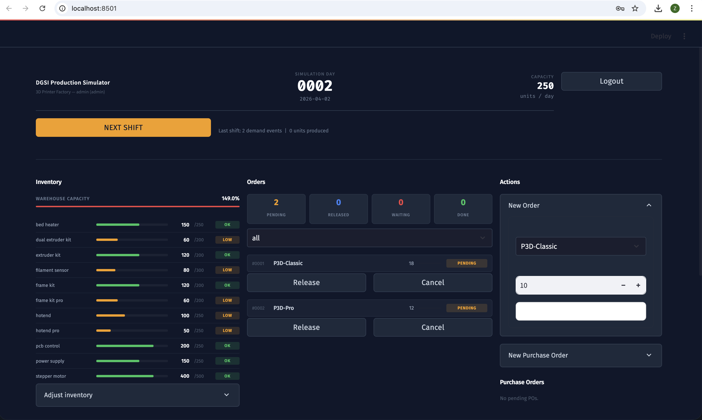
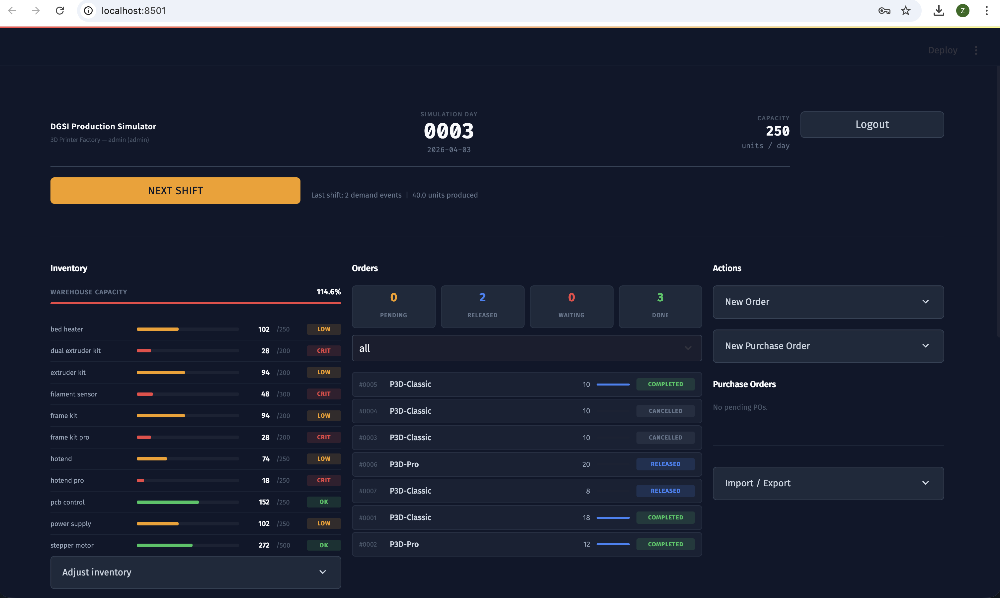
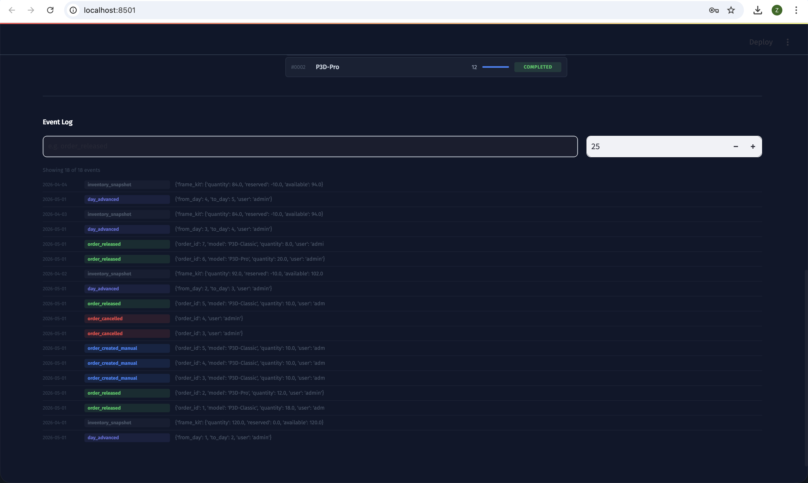
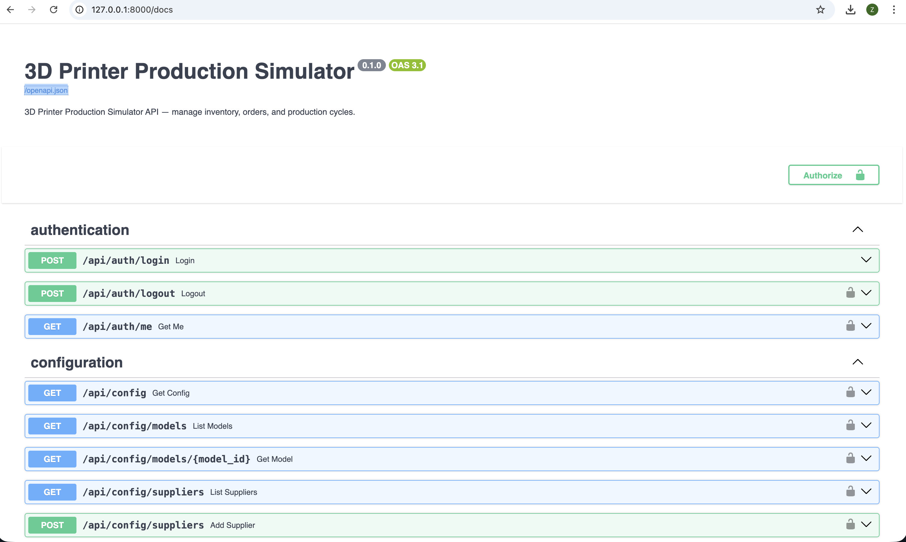
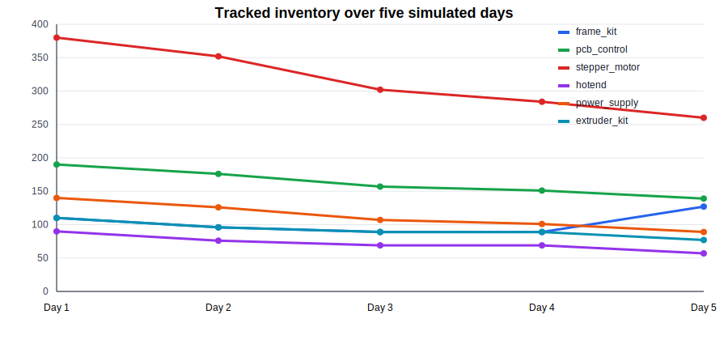

# 3D Printer Production Simulator

## Introduction

This project is a day-by-day production planning simulator for a factory that manufactures 3D printers. The user acts as the production planner: they inspect current inventory, decide which manufacturing orders to release, issue purchase orders to suppliers, and advance the simulated calendar one day at a time.

The implementation is in `manufacturer`. It includes a FastAPI backend, a Streamlit dashboard, a SQLite database, seed data for printer models and materials, and automated tests for the service and API layers.

## A. Design Decisions

### Architecture

The application is split into three main layers:

- **Streamlit dashboard:** user interface for logging in, viewing inventory, viewing orders, creating purchase orders, releasing orders, and advancing the simulation.
- **FastAPI backend:** REST API, request validation, authentication, business actions, and automatic Swagger/OpenAPI documentation at `/docs`.
- **SQLite database through SQLAlchemy:** persistent storage for products, BOM items, inventory, manufacturing orders, purchase orders, events, simulation state, suppliers, and users.

This separation made the project more modular than a single Streamlit script. The dashboard behaves mostly as an API client, while the backend owns the state changes and validation. This also helped satisfy the requirement that every UI feature should be accessible through a REST API.

### Data Model

The core data model follows the production simulator requirements:

| Entity | Purpose |
| --- | --- |
| `ProductModel` | Finished 3D printer models such as `P3D-Classic` and `P3D-Pro`. |
| `BOMItem` | Required raw materials and quantities for each printer model. |
| `Inventory` | Current and reserved quantities for each raw material. |
| `ManufacturingOrder` | Customer/manufacturing demand, status, and production progress. |
| `Supplier` and `SupplierProduct` | Supplier catalog, lead times, packaging, and price tiers. |
| `PurchaseOrder` | Orders issued to suppliers and their expected/actual delivery dates. |
| `EventLog` | Historical record of simulation events and user actions. |
| `SimulationState` | Current simulated day, date, capacity, warehouse capacity, and demand parameters. |
| `User` | Authentication data for dashboard/API access. |

The seeded production plan in `sample_data/default_production_plan.json` defines two printer models and the initial inventory. This makes the simulator reproducible enough for demos and testing.

### Simulation Approach

The project does not use SimPy. Instead, it uses a procedural day loop in `SimulationEngine.advance_day()`. When the user advances the day, the engine:

1. Processes purchase orders that should arrive.
2. Generates new random demand.
3. Produces released manufacturing orders within daily capacity.
4. Records an inventory snapshot.
5. Increments the current simulation day and date.

This approach is simpler for a click-based dashboard because the simulation advances in discrete daily steps. SimPy would be useful for a more detailed continuous-event simulation, but it would also add complexity that was not necessary for the minimum requirements.

### Trade-Offs

The biggest trade-off was choosing a complete backend/API architecture over a simpler Streamlit-only application. The API approach took more setup time, but it gave us Swagger documentation, cleaner state management, and better testability.

Another trade-off was adding JWT authentication. It goes beyond the minimum requirements, but it makes the project feel closer to a real planning tool and protects the state-changing API endpoints.

The dashboard currently uses a local hardcoded API URL, `http://localhost:8000`. This is simple for local development, but a production-ready version should move it to configuration.

Finally, demand generation and partial purchase deliveries are random. This adds realism, but it makes scenario reporting harder unless the run is carefully recorded or randomness is controlled.

## B. PRD Process with AI

The team used a PRD-first workflow before and during implementation. The main PRD is stored in `docs/PRD.md`, and additional planning documents are stored under `docs/superpowers/plans/`. These documents helped keep the work organized across backend, simulation logic, REST endpoints, dashboard UI, tests, and Docker support.

In practice, AI assistants were used as implementation partners. The team first used them to turn the assignment brief into a PRD with concrete entities, API routes, services, and milestones. After that, the PRD and the plan files became the shared context for coding sessions: before asking for a feature, we pointed the AI back to the planned architecture and asked it to work inside the existing model/service/API split. When suggestions conflicted with the intended architecture, the team kept the simpler or more consistent option instead of accepting the first generated answer.

### What Changed During Implementation

The PRD describes a full FastAPI + Streamlit + SQLite architecture, and the current implementation follows that direction. Some parts became more ambitious than the minimum task, especially JWT authentication and Docker support. Other parts are simpler than the PRD: for example, the current demand generator exposes demand parameters through the API, but the implementation still uses a simple random distribution of 1-3 orders per day and 5-20 units per order.

### Prompt Examples

Effective prompts:

- "Read the project specification and help draft a PRD covering the data model, architecture, API endpoints, and milestones. Ask clarifying questions before drafting."
- "Implement the order release flow using the existing SQLAlchemy models: calculate BOM requirements, reserve inventory, and expose the action through a FastAPI endpoint."
- "Refactor the Streamlit dashboard into reusable components while keeping the FastAPI backend as the source of truth."

Less effective prompt or failure mode:

- A broad request like "build the simulator" was not effective. It produced too many assumptions at once and made it harder to check correctness. Smaller prompts tied to one endpoint, service, or UI panel worked better.

### Lessons from the PRD Process

The PRD-first approach helped avoid architecture drift. The project stayed close to the planned FastAPI + Streamlit + SQLite structure, and most functionality ended up in clear layers: models for persistence, services for business logic, API endpoints for access, and dashboard components for presentation. The largest divergence was in simulation detail. The PRD describes configurable demand parameters, but the implemented demand generator still uses a simpler random distribution. The team also added authentication and Docker support, which were useful but made the project larger than the minimum assignment.

## C. Working Application Screenshots

The application was run with:

```bash
cd manufacturer
PYTHONPATH=. uvicorn app.main:app --reload --port 8000
PYTHONPATH=. streamlit run dashboard/pages.py
```

Default dashboard credentials:

- Username: `admin`
- Password: `admin123`

### Dashboard



The dashboard view shows the current simulated day in the header, inventory levels with visual fill indicators, manufacturing orders with status labels, purchase-order controls, and the event log. This is the planner's main workspace: it exposes the decisions that matter each day without requiring direct database access.

### Day Cycle







For the day-cycle demonstration, the planner starts with pending demand and available stock, releases feasible manufacturing orders, optionally creates a purchase order for a bottleneck material, and then advances the day. After the day advances, the dashboard shows updated inventory, completed production, newly generated demand, and new event-log entries.

### Swagger / OpenAPI



The FastAPI backend exposes Swagger documentation at `http://localhost:8000/docs`. The main API groups are authentication, configuration, inventory, orders, purchase orders, simulation, events, and import/export.

## D. Five-Day Test Scenario

### Scenario Setup

The scenario used the seeded production plan from `manufacturer/sample_data/default_production_plan.json`. To make the run reproducible for the report, the scenario was executed with a fixed random seed (`42`) against a freshly seeded in-memory database. The most important materials tracked were:

- `frame_kit`
- `pcb_control`
- `stepper_motor`
- `hotend`
- `power_supply`
- `extruder_kit`

The full exported state is saved as `report_assets/final-state.json`, and the day-by-day table data is saved as `report_assets/scenario-summary.csv`.

### Scenario Results

| Day | Planner decision | Orders generated or handled | Purchases issued/received | Inventory notes | Result |
| --- | --- | --- | --- | --- | --- |
| 1 | Created and released one `P3D-Classic` order for 10 units. | Manual order #1 released. Random demand generated three new orders: Classic 5, Pro 12, Classic 9. | No purchase order issued. | `frame_kit` 110, `pcb_control` 190, `stepper_motor` 380, `hotend` 90, `power_supply` 140, `extruder_kit` 110. | Manual order completed; simulation moved to day 2. |
| 2 | Released feasible `P3D-Classic` pending orders. | Released order ids 2 and 4. Random demand generated Classic 7, Pro 6, Classic 7. | PO #1 issued for 50 `frame_kit` units from Supplier 1, expected 2026-04-05. | `frame_kit` 96, `pcb_control` 176, `stepper_motor` 352, `hotend` 76, `power_supply` 126, `extruder_kit` 96. | Released work consumed reserved materials; completed order count increased to 3. |
| 3 | Released the first two feasible pending orders. | Released order ids 3 and 5. Random demand generated Classic 5. | PO #2 issued for 100 `stepper_motor` units from Supplier 3, expected 2026-04-07. | `frame_kit` 89, `pcb_control` 157, `stepper_motor` 302, `hotend` 69, `power_supply` 107, `extruder_kit` 89. | Production continued, but both purchase orders were still in transit. |
| 4 | Released one additional feasible pending order and waited for purchases. | Released order id 6. Random demand generated Classic 18, Classic 19, Pro 5. | No new purchase order; earlier POs still pending. | `frame_kit` 89, `pcb_control` 151, `stepper_motor` 284, `hotend` 69, `power_supply` 101, `extruder_kit` 89. | Inventory pressure increased while lead times delayed replenishment. |
| 5 | Released two more feasible orders and advanced to receive due deliveries. | Released order ids 7 and 8. Random demand generated Pro 15. | PO #1 arrived with 50 `frame_kit` units. | `frame_kit` 127, `pcb_control` 139, `stepper_motor` 260, `hotend` 57, `power_supply` 89, `extruder_kit` 77. | Frame-kit delivery restored short-term capacity for Classic production. |

### Chart



The chart shows the tracked inventory levels after each simulated day. `frame_kit` falls during the first four days and then recovers on day 5 when the purchase order arrives. Other materials continue to decrease because their replenishment lead times have not completed yet.

### Analysis

During the scenario, the interesting planning tension came from balancing demand, stock reservations, production capacity, and supplier lead times.

The most visible bottleneck was `frame_kit`, because every `P3D-Classic` order consumes one frame kit per unit. Starting from 120 units, stock dropped to 89 by day 3. The planner reacted on day 2 by buying 50 more frame kits. Because Supplier 1 has a three-day lead time, those materials did not arrive immediately; they arrived during the day-5 advance. This shows the central planning problem in the simulator: waiting until stock is nearly empty is risky because new demand can arrive before replenishment does.

The second pressure point was `stepper_motor`. It decreased from 400 to 260 across five days, and the purchase order issued on day 3 was still pending at the end of day 5 because Supplier 3 has a four-day lead time. This demonstrates that purchase decisions need to anticipate future production, not only current shortages.

The final state was exported using:

```bash
curl -H "Authorization: Bearer <TOKEN>" http://localhost:8000/api/export/full-state
```

The final exported state records simulation day 6, 12 total manufacturing orders, 8 completed orders, 4 pending orders, one delivered purchase order, and one pending purchase order.

## E. Vibe Coding Reflection

### Where It Struggled

Since Qwen Code is no longer free, we became frustrated with relying on the free tiers of other models. We spent a lot of time switching between models (Copilot, Claude, Codex, etc.) simply because we kept reaching usage limits. Therefore, the main difficulties were not only figuring out the best prompts to obtain high-quality results, but also having limited reliable options available. Gemini, for example, often did not respond. Other challenges included handling broad prompts, maintaining consistency across nested project paths, managing dependencies and environment setup (which caused errors when running the project), and ensuring the reproducibility of random simulation behavior.

### What We Would Do Differently

Next time, we would define a smaller MVP first, keep a short project context document updated, write scenario scripts earlier, control randomness for demos and reports, and keep commits linked to GitHub issues from the start.

The main lesson is that AI-assisted development still needs a strong steering mechanism. Tasks were easier to handle when they were narrow and the acceptance criteria were explicit. When the request was too broad, the AI tended to produce a large amount of code that then needed review and correction. For a future project, we would freeze the minimum feature set earlier, add deterministic demo scripts sooner, and keep environment constraints such as the supported Python version documented from the beginning.


## Verification

The project was verified in a Python 3.13 virtual environment:

```bash
cd manufacturer
.venv/bin/python --version
.venv/bin/python -m pytest -q
```

Result:

```text
Python 3.13.9
33 passed
```

Known warnings remain around deprecated datetime usage, FastAPI startup events, and Pydantic class-based config. These warnings do not currently block the tests.

## Conclusion

The project implements the main Week 5 requirements: a production simulator with day advancement, inventory management, manufacturing order release, supplier purchasing, event history, JSON import/export, a Streamlit dashboard, and REST API documentation.

The most important remaining work is to polish reproducible scenario reporting, collect final screenshots, and make the demo data/results clear in the final PDF and presentation.

## Appendix: Useful Commands

Install and test:

```bash
cd manufacturer
/opt/local/bin/python3.13 -m venv .venv
source .venv/bin/activate
python -m pip install --upgrade pip
pip install -r requirements.txt
pytest -q
```

Run the backend and dashboard:

```bash
cd manufacturer
PYTHONPATH=. .venv/bin/uvicorn app.main:app --reload --port 8000
PYTHONPATH=. .venv/bin/streamlit run dashboard/pages.py
```

Generate PDF:

```bash
pandoc report.md -o report.pdf --pdf-engine=xelatex
```
